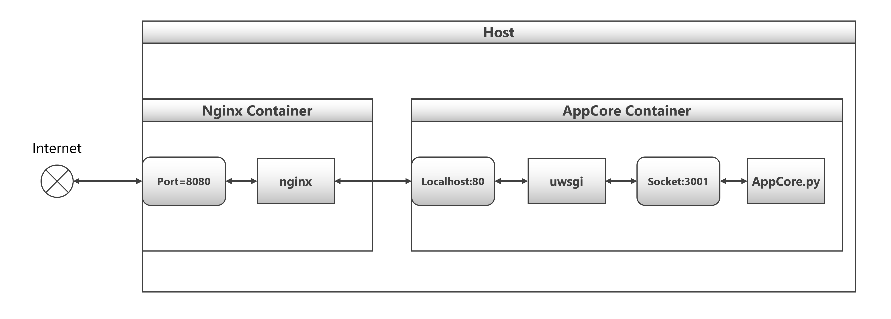

# BridgeDrop

AirDropが使えない環境でも、AirDropのように直感的にファイルを送れるファイル転送ツール。

**開発開始**: 2026/01/04(土)

## コンセプト

- **全OS対応**: Windows、Mac、Linux、iOS、Android - ブラウザがあれば動作
- **低スペックでも動作**: GPUは不要、メモリ消費も最小限
- **PWA対応**: ホーム画面に追加すればネイティブアプリのように使用可能
- **プライバシー保護**: ファイルは一定時間後に自動削除

## 仕組み

1. **送信者**: ファイルを選択 → サーバーにアップロード
2. **サーバー**: 一時的にファイルを保存し、ダウンロード用URLとQRコードを発行
3. **受信者**: QRコードを読み取る（またはURLを開く） → ファイルをダウンロード
4. **自動削除**: ファイルは一定時間後に自動で消滅

## 必要環境

- Docker
- Docker Compose

## 起動方法

```bash
docker compose up --build
```

起動後、ブラウザで http://localhost:8080 にアクセス

## ベースプロジェクト

[NULL62d3/min-docker-flask-nginx](https://github.com/NULL62d3/min-docker-flask-nginx)

## システム構成

Nginx + Flask (uWSGI) 構成


